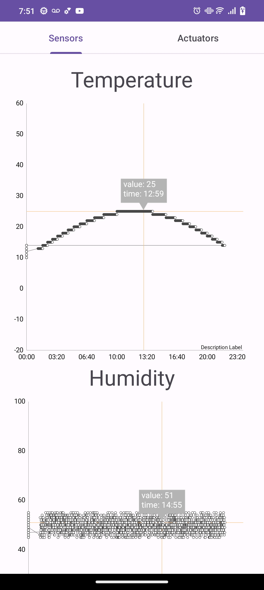
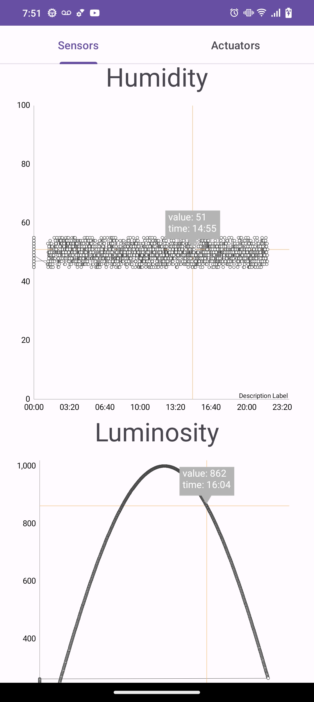

# Climapp

Aplicacion de monitoreo ambiental.

## Tabla de Contenido

1. [Descripción del proyecto](#descripción-del-proyecto)
2. [Hardware](#hardware)
3. [Software](#software)
4. [Funcionalidades](#funcionalidades)
5. [Capturas de pantalla](#capturas-de-pantalla)
6. [Permisos requeridos](#permisos-requeridos)
7. [Licencia](#licencia)

## Descripción del proyecto

Climapp es una aplicacion Android que se conecta con [Firebase](https://firebase.google.com/) para obtener los datos que se muestran. Las variables sensadas son enviadas a Firebase mediante un modulo Arduino, sensores de temperatura, humedad y luminosidad. La aplicacion muestra graficos utilizando la libreria [MPAndroidChart](https://github.com/PhilJay/MPAndroidChart).

## Hardware

El hardware de este proyecto se basa en un módulo Arduino junto con varios sensores para capturar datos ambientales.

- **Arduino**: Esta es la pieza central de nuestro sistema de hardware. Todos los sensores se conectan con Arduino para recoger datos.

- **Sensor de temperatura**: Este sensor se utiliza para capturar la temperatura ambiental.

- **Sensor de humedad**: Este sensor recoge información sobre la humedad en el aire.

- **Sensor de luminosidad**: Este sensor se utiliza para medir la cantidad de luz en el entorno.

Los datos recogidos por estos sensores son enviados a Firebase para su almacenamiento y posterior análisis.

## Software

El software de este proyecto consiste en una aplicación de Android que se conecta con Firebase para recuperar y visualizar los datos del clima.

- **Firebase**: Utilizamos Firebase para almacenar y recuperar los datos recogidos por nuestro sistema de hardware. Los datos se almacenan en tiempo real, lo que permite a la aplicación mostrar las condiciones actuales en cualquier momento.

- **Android**: Esta es la plataforma en la que se construye nuestra aplicación. La aplicación recupera los datos del clima de Firebase y los muestra al usuario.

- **MPAndroidChart**: Esta biblioteca se utiliza para visualizar los datos del clima en forma de gráficos en nuestra aplicación. Los gráficos ayudan a entender las tendencias y los patrones en los datos del clima.

## Funcionalidades

Nuestra aplicación de Android ofrece las siguientes funcionalidades:

1. **Visualización de datos en tiempo real**: La aplicación recupera y muestra datos del clima en tiempo real desde Firebase.

2. **Gráficos de clima**: La aplicación utiliza MPAndroidChart para visualizar los datos del clima.

## Capturas de pantalla

|                                                                |                                                                |
| :------------------------------------------------------------: | :------------------------------------------------------------: |
|  |  |

## Permisos requeridos

Para que la aplicación funcione correctamente, se requieren los siguientes permisos:

- Acceso a Internet: Necesario para conectarse a Firebase y recuperar los datos del clima.

## Licencia

Este proyecto está licenciado bajo los términos de la licencia MIT. Consulte el archivo [LICENSE](LICENSE) para más detalles.
